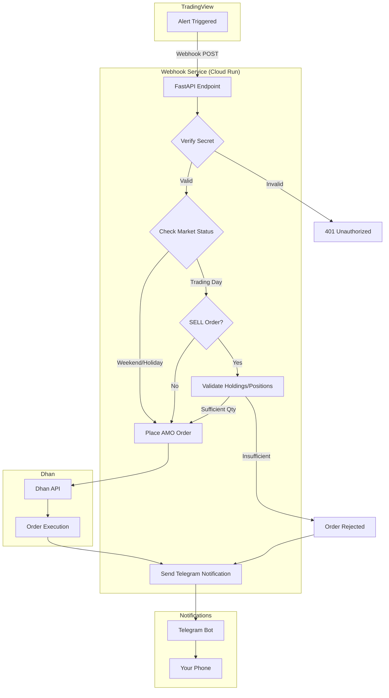
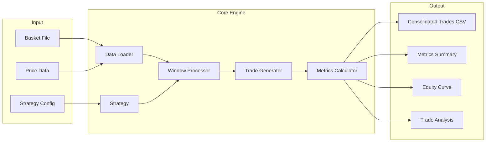
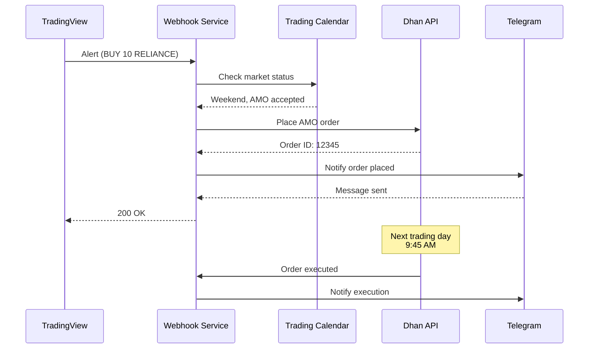
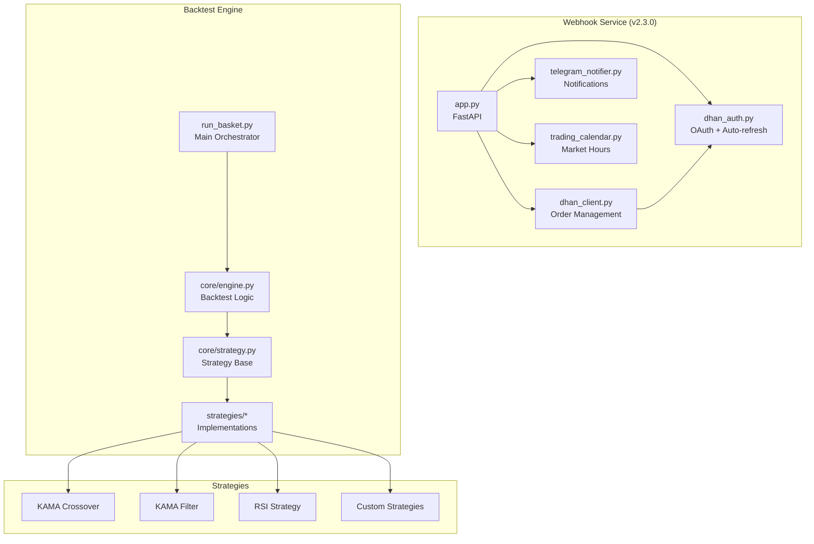

# Quick Start Guide - Remaining Tasks

## ✅ Completed (3/5)

1. **Dhan Order Types Analysis** - DONE
   - Created comprehensive comparison document
   - Identified IOC and AMO timing as Phase 2 enhancements
   
2. **NSE/BSE Trading Calendar** - DONE
   - Full calendar implementation with 2025/2026 holidays
   - Market session tracking
   - Integrated into webhook service
   
3. **Telegram Credentials** - DONE
   - Updated .env with bot token and chat ID
   - Ready for testing

---

## ⏳ Remaining (2/5)

### Task 4: Time Monitoring in run_basket.py

**What to do:**
Add execution time tracking to identify bottlenecks in basket backtesting.

**Implementation Plan:**

```python
# Step 1: Add timing infrastructure at top of run_basket.py
import time
from contextlib import contextmanager

class Timer:
    """Simple timer for performance monitoring"""
    def __init__(self):
        self.timings = {}
    
    @contextmanager
    def measure(self, phase_name):
        """Context manager to measure execution time"""
        start = time.time()
        yield
        elapsed = time.time() - start
        self.timings[phase_name] = self.timings.get(phase_name, 0) + elapsed
    
    def report(self):
        """Print timing report"""
        print("\n" + "=" * 80)
        print("⏱️  EXECUTION TIME REPORT")
        print("=" * 80)
        total = sum(self.timings.values())
        for phase, duration in sorted(self.timings.items(), key=lambda x: x[1], reverse=True):
            pct = (duration / total * 100) if total > 0 else 0
            print(f"  {phase:40s} {duration:8.2f}s ({pct:5.1f}%)")
        print("-" * 80)
        print(f"  {'TOTAL':40s} {total:8.2f}s (100.0%)")
        print("=" * 80)

# Step 2: Initialize timer
timer = Timer()

# Step 3: Wrap each major phase
with timer.measure("Data Loading"):
    # Load CSV data
    price_data = load_price_data(...)

with timer.measure("Strategy Initialization"):
    # Initialize strategy
    strategy = StrategyClass(...)

with timer.measure("Window Processing"):
    # Process sliding windows
    for window in windows:
        ...

with timer.measure("Trade Generation"):
    # Generate trades
    trades = generate_trades(...)

with timer.measure("Metrics Calculation"):
    # Calculate metrics
    metrics = calculate_metrics(...)

with timer.measure("Report Generation"):
    # Generate reports
    generate_reports(...)

# Step 4: Print timing report at end
timer.report()
```

**Expected Output:**
```
================================================================================
⏱️  EXECUTION TIME REPORT
================================================================================
  Data Loading                              15.23s (45.2%)
  Window Processing                         10.45s (31.0%)
  Metrics Calculation                        5.67s (16.8%)
  Trade Generation                           1.89s ( 5.6%)
  Strategy Initialization                    0.34s ( 1.0%)
  Report Generation                          0.12s ( 0.4%)
--------------------------------------------------------------------------------
  TOTAL                                     33.70s (100.0%)
================================================================================
```

**Testing:**
```bash
cd /Users/abhishekshah/Desktop/quantlab-workspace
python3 run_basket.py --basket basket_test.txt --timeframe 1d
# Check timing report at end of output
```

---

### Task 5: Mermaid Architecture Diagram

**What to do:**
Create comprehensive flowchart for main README showing entire system architecture.

**Implementation Plan:**

Add to `README.md` after the "Quick Start" section:

````markdown
## 🏗️ Architecture

### Webhook Service Flow



### Backtest Engine Flow



### Data Flow



### Component Architecture


```
````

**Testing:**
- Paste into GitHub README.md
- Verify diagrams render correctly
- Check on GitHub web interface
- Adjust layout if needed

**Tools:**
- GitHub supports Mermaid natively
- VS Code: Install "Markdown Preview Mermaid Support" extension
- Online editor: https://mermaid.live/

---

## Testing Instructions

### Test 1: Webhook Service with Telegram

```bash
# Terminal 1: Start webhook service
cd /Users/abhishekshah/Desktop/quantlab-workspace/webhook-service
python3 app.py

# Should see:
# 🏛️  Market Status: WEEKEND - Sunday - Market closed
# ✅ AMO Orders: ACCEPTED - Will execute on 2025-11-24
# ✅ Telegram notifications enabled for chat 5055508551
# 🔄 Auto health check enabled

# Terminal 2: Send test webhook
cd /Users/abhishekshah/Desktop/quantlab-workspace/webhook-service
bash test_telegram.sh

# Expected Results:
# 1. HTTP 200 OK response
# 2. Three Telegram messages:
#    a) Alert received (shows market status)
#    b) Order result (success/reject)
#    c) Batch summary
```

### Test 2: Market Status API

```bash
# Test market status endpoint
curl http://localhost:8080/market-status | jq

# Expected output:
{
  "current_time": "2025-11-23T11:45:00+05:30",
  "market": {
    "status": "WEEKEND",
    "message": "Sunday - Market closed",
    "is_trading_day": false,
    "next_trading_day": "2025-11-24"
  },
  "sessions": {
    "pre_market": false,
    "normal_trading": false,
    "post_market": false,
    "amo_window": false
  },
  "amo_orders": {
    "accepted": true,
    "message": "AMO accepted - Will execute on next trading day 2025-11-24"
  },
  "upcoming_holidays": [
    "2025-12-25",
    "2026-01-26",
    ...
  ]
}
```

### Test 3: Time Monitoring

```bash
# After implementing timer in run_basket.py
cd /Users/abhishekshah/Desktop/quantlab-workspace
python3 run_basket.py \
  --basket data/basket_test.txt \
  --timeframe 1d \
  --strategy kama-crossover

# Check for timing report at end of output
# Identify slowest phases
# Consider optimizations
```

---

## Deployment Checklist

### Pre-Deployment
- [ ] Test webhook service locally
- [ ] Verify 3 Telegram messages received
- [ ] Test market status endpoint
- [ ] Confirm market calendar dates accurate
- [ ] Review IMPLEMENTATION_SUMMARY.md

### Deployment
- [ ] Update version to 2.3.0 in app.py (already done)
- [ ] Run `cd webhook-service && ./deploy.sh`
- [ ] Set Telegram env vars in Cloud Run
- [ ] Test production webhook endpoint
- [ ] Monitor logs for 24 hours

### Post-Deployment
- [ ] Test with real TradingView alert
- [ ] Verify Telegram notifications
- [ ] Check market status during different sessions
- [ ] Update documentation with lessons learned
- [ ] Create GitHub release v2.3.0

---

## Quick Commands Reference

```bash
# Start webhook service
cd webhook-service && python3 app.py

# Test webhook
bash webhook-service/test_telegram.sh

# Check market status
curl http://localhost:8080/market-status | jq

# View logs
tail -f webhook-service/webhook_orders.csv

# Test trading calendar
python3 webhook-service/trading_calendar.py

# Deploy to Cloud Run
cd webhook-service && ./deploy.sh

# Run backtest with timing
python3 run_basket.py --basket data/basket_test.txt --timeframe 1d
```

---

## Documentation Index

### Core Docs
- [README.md](README.md) - Main project documentation
- [webhook-service/README.md](webhook-service/README.md) - Webhook service guide
- [docs/QUANTLAB_GUIDE.md](docs/QUANTLAB_GUIDE.md) - Backtesting guide

### New Docs (This Session)
- [webhook-service/docs/DHAN_ORDER_TYPES_ANALYSIS.md](webhook-service/docs/DHAN_ORDER_TYPES_ANALYSIS.md) - Order types comparison
- [webhook-service/IMPLEMENTATION_SUMMARY.md](webhook-service/IMPLEMENTATION_SUMMARY.md) - Complete implementation summary
- [webhook-service/trading_calendar.py](webhook-service/trading_calendar.py) - Market calendar module

### Existing Docs
- [webhook-service/docs/TELEGRAM_SETUP.md](webhook-service/docs/TELEGRAM_SETUP.md) - Telegram setup
- [webhook-service/DEPLOYMENT_CHECKLIST.md](webhook-service/DEPLOYMENT_CHECKLIST.md) - Deployment steps
- [webhook-service/docs/SELL_ORDER_VALIDATION.md](webhook-service/docs/SELL_ORDER_VALIDATION.md) - SELL validation

---

**Last Updated:** November 23, 2025  
**Tasks Remaining:** 2/5  
**Priority:** Task 4 (Time Monitoring) → Task 5 (Mermaid Diagram)
