# QuantLab v2.2 - Professional Trading System

[](https://www.python.org/downloads/)
[](https://github.com/features/actions)
[](https://github.com/psf/black)
[](https://github.com/astral-sh/ruff)
[](LICENSE)

**Professional backtesting framework for Indian equities with clean architecture and comprehensive risk analysis**

**Status:** ✅ Production Ready | **Data Fetch Success Rate:** 99.5%

---

## 🚀 Quick Start

### Installation
```bash
git clone <repo> quantlab && cd quantlab
python -m venv .venv && source .venv/bin/activate
pip install -e ".[dev]"
python config.py  # Verify system ready
```

### Run a Backtest
```bash
# EMA Crossover on Mega Basket
python runners/run_basket.py --basket mega --strategy ema_crossover --timeframe 1d
```

### Fetch Historical Data
```bash
# Download 2 years of data
python scripts/dhan_fetch_data.py --basket large --timeframe 1d

# Multi-timeframe (25m → 75m, 125m automatic)
python scripts/dhan_fetch_data.py --basket mega --timeframe 25m
```

---

## 📊 System Architecture & Workflow

```mermaid
---
config:
  layout: elk
  theme: base
  themeVariables:
    primaryTextColor: '#000000'
    secondaryTextColor: '#000000'
    tertiaryTextColor: '#000000'
    lineColor: '#ffffff'
    primaryColor: '#e3f2fd'
    secondaryColor: '#fff8e1'
---
flowchart TB
    subgraph External["📡 External Services"]
        TV[("🔔 TradingView<br/>Alerts")]
        DHAN[("🏦 Dhan API<br/>Broker")]
        TG[("📱 Telegram<br/>Notifications")]
    end

    subgraph CloudRun["☁️ Google Cloud Run"]
        WH["🌐 Webhook Service<br/>/webhook endpoint"]
        AUTH["🔐 OAuth Handler<br/>Token Refresh"]
        QUEUE["📋 Signal Queue<br/>After-hours storage"]
        FS[("🔥 Firestore<br/>Logs & State")]
    end

    subgraph LocalDev["💻 Local Development"]
        subgraph DataPipeline["📥 Data Pipeline"]
            FETCH["scripts/dhan_fetch_data.py"]
            CACHE[("data/cache/<br/>OHLCV CSVs")]
            BASKETS["data/basket_*.txt<br/>Symbol Lists"]
        end

        subgraph BacktestEngine["⚙️ Backtesting Engine"]
            ENGINE["core/engine.py<br/>Event-Driven Engine"]
            STRAT["strategies/*.py<br/>Trading Strategies"]
            CONFIG["core/config.py<br/>Broker Settings"]
        end

        subgraph Runners["🏃 Runners"]
            BASKET["runners/run_basket.py<br/>Portfolio Backtest"]
            FAST["runners/fast_run_basket.py<br/>Parallel Backtest"]
        end

        subgraph Output["📈 Output"]
            REPORTS["reports/<br/>HTML + CSV"]
            VIZ["viz/<br/>Charts"]
        end
    end

    %% Data Flow
    TV -->|"JSON Alert"| WH
    WH -->|"Execute Order"| DHAN
    WH -->|"Send Notification"| TG
    WH <-->|"Token Refresh"| AUTH
    AUTH <-->|"OAuth Flow"| DHAN
    WH -->|"Log Orders"| FS
    WH -->|"Queue if closed"| QUEUE
    QUEUE -->|"Execute on open"| DHAN

    %% Local Flow
    DHAN -->|"Historical Data"| FETCH
    FETCH -->|"Store"| CACHE
    BASKETS --> BASKET
    CACHE --> BASKET
    CACHE --> FAST
    BASKETS --> FAST
    STRAT --> ENGINE
    CONFIG --> ENGINE
    ENGINE --> BASKET
    ENGINE --> FAST
    BASKET --> REPORTS
    FAST --> REPORTS
    REPORTS --> VIZ

    %% Styling
    classDef external fill:#e1f5fe,stroke:#01579b
    classDef cloud fill:#fff3e0,stroke:#e65100
    classDef local fill:#e8f5e9,stroke:#2e7d32
    classDef data fill:#fce4ec,stroke:#880e4f

    class TV,DHAN,TG external
    class WH,AUTH,QUEUE,FS cloud
    class ENGINE,STRAT,CONFIG,BASKET,FAST local
    class FETCH,CACHE,BASKETS,REPORTS,VIZ data
```



### Workflow Summary

| Phase | Component | Description |
|-------|-----------|-------------|
| **1. Data Fetch** | `dhan_fetch_data.py` | Downloads OHLCV from Dhan API → `data/cache/` |
| **2. Strategy Dev** | `strategies/*.py` | Define entry/exit logic using indicators |
| **3. Backtesting** | `core/engine.py` | Event-driven simulation with next-open execution |
| **4. Portfolio Test** | `runners/fast_run_basket.py` | Parallel backtest across symbol baskets |
| **5. Analysis** | `reports/` | HTML dashboards, trade logs, equity curves |
| **6. Live Trading** | `webhook-service/` | TradingView → Cloud Run → Dhan execution |
| **7. Monitoring** | Telegram | Real-time order notifications |

---

## 🔬 Detailed Component Architecture

```mermaid
---
config:
  layout: elk
  theme: base
  themeVariables:
    primaryTextColor: '#000000'
    secondaryTextColor: '#000000'
    tertiaryTextColor: '#000000'
    lineColor: '#ffffff'
    primaryColor: '#e3f2fd'
    secondaryColor: '#fff8e1'
---
flowchart TB
    subgraph DataLayer["📂 DATA LAYER"]
        direction TB
        
        subgraph Sources["Data Sources"]
            DHAN_API["🏦 Dhan API<br/>v2/charts/historical"]
            MASTER["📋 api-scrip-master-detailed.csv<br/>Symbol → Security ID mapping"]
        end
        
        subgraph Baskets["Symbol Baskets"]
            B_DEFAULT["basket_default.txt<br/>474 symbols"]
            B_LARGE["basket_largecap_*.txt"]
            B_MID["basket_midcap_*.txt"]
            B_SMALL["basket_smallcap_*.txt"]
            B_TEST["basket_test.txt<br/>5 symbols"]
        end
        
        subgraph Cache["Cache Layer"]
            CSV_CACHE["data/cache/<br/>dhan_SECID_SYMBOL_1d.csv"]
        end
        
        DHAN_FETCH["📥 scripts/dhan_fetch_data.py<br/>• Token validation<br/>• 90-day chunking<br/>• Multi-timeframe aggregation"]
    end
    
    subgraph CoreEngine["⚙️ CORE ENGINE"]
        direction TB
        
        subgraph Config["Configuration"]
            BROKER_CFG["core/config.py<br/>BrokerConfig<br/>• initial_capital: 100K<br/>• qty_pct: 5%<br/>• commission: 0.11%<br/>• slippage: 3 ticks"]
        end
        
        subgraph Engine["Backtesting Engine"]
            ENGINE_MAIN["core/engine.py<br/>BacktestEngine<br/>• Event-driven loop<br/>• Next-open execution<br/>• State validation<br/>• Pyramiding support"]
            DATA_VAL["core/data_validation.py<br/>• Gap detection<br/>• Fingerprinting"]
        end
        
        subgraph StrategyLayer["Strategy Framework"]
            STRAT_BASE["core/strategy.py<br/>Strategy base class<br/>• prepare(df)<br/>• next(row, state)"]
            REGISTRY["core/registry.py<br/>make_strategy(name)<br/>• Dynamic instantiation"]
        end
        
        subgraph Metrics["Metrics & Reporting"]
            METRICS["core/metrics.py<br/>• compute_perf()<br/>• Sharpe/Sortino/Calmar<br/>• Alpha/Beta vs NIFTYBEES<br/>• Max drawdown"]
            REPORT["core/report.py<br/>• make_run_dir()<br/>• save_trades/equity"]
        end
    end
    
    subgraph Strategies["📈 STRATEGIES"]
        direction LR
        S1["ema_crossover.py<br/>Fast/Slow EMA"]
        S2["ichimoku_cloud.py<br/>Cloud + Chikou"]
        S3["bollinger_rsi.py<br/>BB + RSI confluence"]
        S4["stoch_rsi_pyramid_long.py<br/>Pyramiding entries"]
        S5["candlestick_patterns.py<br/>20+ patterns"]
        S6["kama_crossover_filtered.py<br/>KAMA + KER filter"]
    end
    
    subgraph Indicators["🔧 INDICATORS (utils/indicators.py)"]
        direction LR
        IND_MA["Moving Averages<br/>SMA, EMA, WMA, HMA, KAMA"]
        IND_MOM["Momentum<br/>RSI, MACD, Stochastic"]
        IND_TREND["Trend<br/>ADX, Supertrend, Ichimoku"]
        IND_VOL["Volatility<br/>ATR, Bollinger, Keltner"]
    end
    
    subgraph Runners["🏃 RUNNERS"]
        direction TB
        RUN_BASKET["runners/run_basket.py<br/>• Sequential execution<br/>• Full reporting"]
        RUN_FAST["runners/fast_run_basket.py<br/>• Multiprocessing (7 workers)<br/>• 1Y/3Y/5Y/MAX windows<br/>• Portfolio curves"]
        LOADERS["data/loaders.py<br/>load_many_india()<br/>• Cache file discovery<br/>• DataFrame loading"]
    end
    
    subgraph Output["📊 OUTPUT"]
        direction TB
        REPORTS_DIR["reports/MMDD-HHMM-strategy-basket/<br/>├── BACKTEST_METRICS.csv<br/>├── consolidated_trades_*.csv<br/>├── portfolio_key_metrics_*.csv<br/>├── portfolio_equity_curve_*.csv<br/>└── quantlab_dashboard.html"]
    end
    
    %% Data Flow
    DHAN_API --> DHAN_FETCH
    MASTER --> DHAN_FETCH
    DHAN_FETCH --> CSV_CACHE
    
    Baskets --> LOADERS
    CSV_CACHE --> LOADERS
    LOADERS --> RUN_FAST
    LOADERS --> RUN_BASKET
    
    BROKER_CFG --> ENGINE_MAIN
    DATA_VAL --> ENGINE_MAIN
    STRAT_BASE --> REGISTRY
    REGISTRY --> ENGINE_MAIN
    
    Indicators --> Strategies
    Strategies --> REGISTRY
    
    RUN_FAST --> ENGINE_MAIN
    RUN_BASKET --> ENGINE_MAIN
    ENGINE_MAIN --> METRICS
    METRICS --> REPORT
    REPORT --> REPORTS_DIR
    
    classDef data fill:#e3f2fd,stroke:#1565c0
    classDef core fill:#fff8e1,stroke:#f9a825
    classDef strat fill:#e8f5e9,stroke:#2e7d32
    classDef runner fill:#fce4ec,stroke:#c2185b
    classDef output fill:#f3e5f5,stroke:#7b1fa2
    
    class DHAN_API,MASTER,CSV_CACHE,B_DEFAULT,B_LARGE,B_MID,B_SMALL,B_TEST,DHAN_FETCH data
    class BROKER_CFG,ENGINE_MAIN,DATA_VAL,STRAT_BASE,REGISTRY,METRICS,REPORT core
    class S1,S2,S3,S4,S5,S6,IND_MA,IND_MOM,IND_TREND,IND_VOL strat
    class RUN_BASKET,RUN_FAST,LOADERS runner
    class REPORTS_DIR output
```



---

## 🌐 Webhook Service Architecture

```mermaid
---
config:
  layout: elk
  theme: base
  themeVariables:
    primaryTextColor: '#000000'
    secondaryTextColor: '#000000'
    tertiaryTextColor: '#000000'
    lineColor: '#ffffff'
    primaryColor: '#e3f2fd'
    secondaryColor: '#fff8e1'
---
flowchart TB
    subgraph External["External Systems"]
        TV["🔔 TradingView<br/>Pine Script Alerts"]
        DHAN_BROKER["🏦 Dhan Broker<br/>Order Execution API"]
        TG_BOT["📱 Telegram Bot<br/>Notifications"]
    end
    
    subgraph CloudRun["☁️ Google Cloud Run (webhook-service/)"]
        direction TB
        
        subgraph FastAPI["FastAPI Application (app.py)"]
            EP_WEBHOOK["/webhook<br/>POST - Receive alerts"]
            EP_HEALTH["/health<br/>GET - Health check"]
            EP_OAUTH["/oauth/callback<br/>POST - Token refresh"]
            EP_REFRESH["/refresh-token<br/>POST - Manual refresh"]
            EP_QUEUE["/queue/status<br/>GET - Pending signals"]
        end
        
        subgraph Clients["API Clients"]
            DHAN_CLIENT["dhan_client.py<br/>DhanClient<br/>• Exchange mapping<br/>• Security ID lookup<br/>• Order placement"]
            DHAN_AUTH["dhan_auth.py<br/>DhanAuth<br/>• OAuth flow<br/>• Token refresh<br/>• Credential storage"]
        end
        
        subgraph Services["Services"]
            TG_NOTIFIER["telegram_notifier.py<br/>TelegramNotifier<br/>• Consolidated messages<br/>• Daily stats tracking"]
            SIG_QUEUE["signal_queue.py<br/>SignalQueue<br/>• Firestore persistence<br/>• After-hours storage"]
            TRADE_CAL["trading_calendar.py<br/>• Market hours check<br/>• Holiday calendar 2025-26<br/>• AMO timing"]
        end
        
        subgraph Storage["Persistence"]
            FIRESTORE["🔥 Firestore<br/>• Order logs<br/>• Signal queue<br/>• Execution history"]
            SEC_MAP["security_id_list.csv<br/>Symbol → Security ID"]
        end
    end
    
    subgraph Scheduler["☁️ Cloud Scheduler"]
        CRON_AM["⏰ 8:00 AM IST<br/>Morning token refresh"]
        CRON_PM["⏰ 8:00 PM IST<br/>Evening token refresh"]
    end
    
    %% Alert Flow
    TV -->|"JSON payload<br/>{secret, alertType, order_legs}"| EP_WEBHOOK
    EP_WEBHOOK --> TRADE_CAL
    TRADE_CAL -->|"Market Open"| DHAN_CLIENT
    TRADE_CAL -->|"Market Closed"| SIG_QUEUE
    
    DHAN_CLIENT --> SEC_MAP
    DHAN_CLIENT -->|"place_order()"| DHAN_BROKER
    DHAN_BROKER -->|"Order Response"| EP_WEBHOOK
    
    EP_WEBHOOK -->|"Log Order"| FIRESTORE
    EP_WEBHOOK -->|"notify_order_complete()"| TG_NOTIFIER
    TG_NOTIFIER --> TG_BOT
    
    %% Token Flow
    CRON_AM --> EP_REFRESH
    CRON_PM --> EP_REFRESH
    EP_REFRESH --> DHAN_AUTH
    DHAN_AUTH <-->|"OAuth2"| DHAN_BROKER
    
    %% Queue Flow
    SIG_QUEUE --> FIRESTORE
    CRON_AM -->|"Execute pending"| SIG_QUEUE
    SIG_QUEUE -->|"Replay signals"| DHAN_CLIENT
    
    classDef external fill:#e1f5fe,stroke:#0277bd
    classDef endpoint fill:#fff3e0,stroke:#ef6c00
    classDef client fill:#e8f5e9,stroke:#388e3c
    classDef service fill:#fce4ec,stroke:#c2185b
    classDef storage fill:#f3e5f5,stroke:#7b1fa2
    classDef cron fill:#fffde7,stroke:#f9a825
    
    class TV,DHAN_BROKER,TG_BOT external
    class EP_WEBHOOK,EP_HEALTH,EP_OAUTH,EP_REFRESH,EP_QUEUE endpoint
    class DHAN_CLIENT,DHAN_AUTH client
    class TG_NOTIFIER,SIG_QUEUE,TRADE_CAL service
    class FIRESTORE,SEC_MAP storage
    class CRON_AM,CRON_PM cron
```



---

## 🔄 Backtest Execution Flow


---

## 🏗️ Architecture

```
quantlab/
├── core/               # Event-driven backtesting engine
├── strategies/         # Trading strategies
├── runners/            # Portfolio backtesting & reporting
├── scripts/            # Unified data fetcher (dhan_fetch_data.py)
├── data/               # Market data & baskets
├── utils/              # Indicators & calculations
├── tests/              # Test suite
├── docs/               # Documentation
├── webhook-service/    # TradingView webhook service (Cloud Run)
└── viz/                # Visualization tools
```

---

## ✨ Key Features

### Development Workflow
- 🛠️ **Modern Setup**: Virtual environment with development dependencies
- 📋 **Quality Checks**: Automated linting, formatting, and testing
- 📚 **Documentation**: Comprehensive guides in `docs/`
- 🔄 **CI/CD**: GitHub Actions pipeline with matrix testing
- 🧪 **Testing**: 88+ tests passing with comprehensive coverage
- 🛡️ **Security**: Automated vulnerability scanning

### Risk Analytics
- **Individual Trade Drawdown**: Real intra-trade risk using OHLC data
- **Symbol-Level Max Drawdown**: Highest individual trade drawdown per symbol
- **Run-up Analysis**: Maximum favorable movement tracking
- **Stop Loss Framework**: Optional stop loss with performance comparison

### Comprehensive Reporting
- **Portfolio Key Metrics**: Net P&L, CAGR, Max Drawdown, Profit Factor
- **Consolidated Trades**: Detailed trade logs with entry/exit analysis
- **Equity Curves**: Daily and monthly portfolio progression
- **Multi-Timeframe Analysis**: 1Y, 3Y, 5Y, and ALL period comparisons

---

## 📊 Core Components

### 1. Backtesting Engine (`core/engine.py`)
- **Event-Driven:** Processes bars sequentially
- **Next-Open Execution:** Signals on current bar close → fills at next bar open
- **No Lookahead Bias:** Real-world execution model
- **Supports:** Daily, 75m, 125m, 1m, 5m, 15m, 25m, 60m timeframes
- **Features:** Pyramiding, per-lot stops, slippage modeling

**Key Config** (`core/config.py`):
```python
BrokerConfig(
    initial_capital=100_000,          # Starting capital
    qty_pct_of_equity=0.05,           # 5% per trade
    commission_pct=0.11,              # 0.22% round-trip
    slippage_ticks=3,                 # Realistic slippage
    execute_on_next_open=True,        # ← CRITICAL: Next bar execution
)
```

### 2. Data Fetcher (`scripts/dhan_fetch_data.py`)
- **Universal:** Any basket, symbol, or timeframe
- **Production-Ready:** Token validation, error recovery, smart caching
- **Multi-Timeframe:** Aggregates 25m → 75m, 125m automatically
- **Smart Chunking:** 90-day API limitations handled

**Usage:**
```bash
# Full basket
python scripts/dhan_fetch_data.py --basket large --timeframe 1d

# Multi-timeframe aggregation
python scripts/dhan_fetch_data.py --basket mega --timeframe 25m --days-back 730

# Specific symbols
python scripts/dhan_fetch_data.py --symbols RELIANCE,TCS --timeframe 1d
```

### 3. Strategies
Located in `strategies/`:
- **ema_crossover.py:** Fast/slow EMA crossover
- **ichimoku.py:** Ichimoku cloud with trend confirmation
- **kama_crossover.py:** KAMA-based crossover strategy
- **stoch_rsi_ob_long.py:** Stochastic RSI oversold/overbought
- **candlestick_patterns.py:** 20+ bullish patterns with filters
- **bollinger_rsi.py:** Bollinger Bands with RSI confluence

### 4. Runners & Reporting
```bash
python runners/run_basket.py \
  --basket mega \
  --strategy ema_crossover \
  --timeframe 1d
```

Generates comprehensive reports in `reports/` with:
- HTML dashboard with interactive charts
- CSV trade logs and metrics
- Equity curves and drawdown analysis

---

## 🌐 Webhook Service

Production TradingView webhook service deployed on Google Cloud Run.

**Features:**
- TradingView alert integration
- Dhan order execution
- OAuth token auto-refresh (8 AM/PM IST)
- Signal queuing for after-hours/holidays
- Firestore logging

**Endpoints:**
- `POST /webhook` - Receive TradingView alerts
- `GET /health` - Service health check
- `POST /oauth/callback` - Dhan OAuth callback
- `POST /refresh-token` - Manual token refresh

See `docs/WEBHOOK_SERVICE_COMPLETE_GUIDE.md` for full documentation.

---

## 📚 Documentation

| Document | Description |
|----------|-------------|
| `docs/QUANTLAB_GUIDE.md` | Complete backtesting guide |
| `docs/BACKTEST_GUIDE.md` | Detailed backtest documentation |
| `docs/STRATEGIES.md` | Strategy development guide |
| `docs/WEBHOOK_SERVICE_COMPLETE_GUIDE.md` | Webhook service setup |
| `webhook-service/docs/DHAN_CREDENTIALS_GUIDE.md` | Dhan API credentials |
| `webhook-service/docs/COMPLETE_DEPLOYMENT_GUIDE.md` | Cloud Run deployment |

---

## 🧪 Testing

```bash
# Run all tests
python -m pytest tests/ -v

# With coverage
python -m pytest tests/ --cov=. --cov-report=html

# Webhook service tests
cd webhook-service && python -m pytest tests/ -v
```

**Current Status:** 88 tests passing, 14 skipped (require live data)

---

## 🔧 Development

### Code Quality
```bash
# Format code
black . && isort .

# Lint
ruff check .

# Run pre-commit hooks
pre-commit run --all-files
```

### Project Dependencies
```bash
pip install -e ".[dev]"  # All development dependencies
```

---

## 📈 Performance

- **Backtest Speed:** ~8 stocks/second
- **Data Fetch:** 99.5% success rate
- **Supported Timeframes:** 1m, 5m, 15m, 25m, 60m, 75m, 125m, 1d

---

## 🤝 Contributing

1. Fork the repository
2. Create a feature branch
3. Run tests and quality checks
4. Submit a pull request

---

## 📄 License

MIT License - see [LICENSE](LICENSE) for details.

---

## 🙏 Acknowledgments

- [Dhan](https://dhan.co/) for market data API
- [TradingView](https://tradingview.com/) for charting and alerts
- [pandas-ta](https://github.com/twopirllc/pandas-ta) for technical indicators

